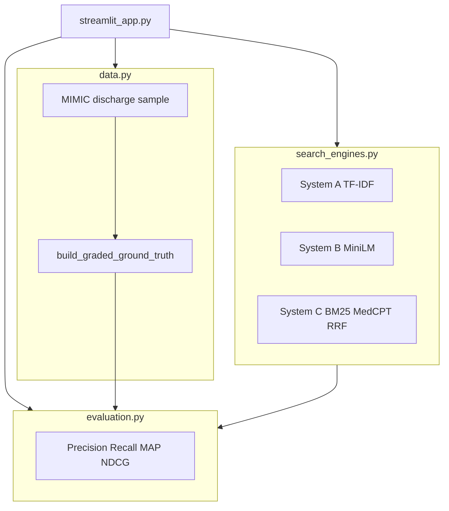
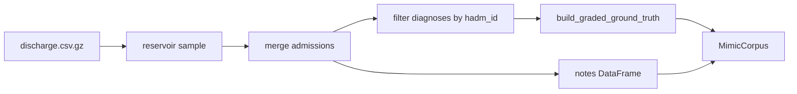

# Clinical IR Evaluation Engine — Technical Documentation

Developer runbook for the **7CS107 Portfolio Evaluation Engine** (Clinical Information Retrieval Dashboard).

**Disclaimer:** Research and education only. Not for clinical decision-making.

---

## Table of contents

1. [Project overview](#1-project-overview)
2. [Repository layout](#2-repository-layout)
3. [Prerequisites and data](#3-prerequisites-and-data)
4. [Environment setup](#4-environment-setup)
5. [Data layer (`data.py`)](#5-data-layer-datapy)
6. [Retrieval systems (`search_engines.py`)](#6-retrieval-systems-search_enginespy)
7. [Evaluation (`evaluation.py`)](#7-evaluation-evaluationpy)
8. [Streamlit UI (`streamlit_app.py`)](#8-streamlit-ui-streamlit_apppy)
9. [Configuration reference](#9-configuration-reference)
10. [Troubleshooting](#10-troubleshooting)
11. [Extending the project](#11-extending-the-project)
12. [References](#12-references)

---

## 1. Project overview

| Item | Detail |
|------|--------|
| **Name** | 7CS107 Portfolio Evaluation Engine — Clinical IR Dashboard |
| **Location** | `clinical_ir_app/` under the DataScience workspace |
| **Purpose** | Compare three retrieval systems on real MIMIC-IV discharge notes with reproducible IR metrics |
| **Course** | 7CS107 portfolio project |
| **Entry point** | `python -m streamlit run streamlit_app.py` |

### What the system does

1. **Loads** a random sample of MIMIC-IV discharge notes (not the first N rows of the file).
2. **Builds** graded relevance labels for 10 clinical queries using ICD codes + note text.
3. **Indexes** the sample with three search engines (lexical, semantic, hybrid).
4. **Evaluates** retrieval with Precision@3, Recall@3, MAP, and NDCG@3.
5. **Displays** live search (3-column) and benchmark results in Streamlit.

### Retrieval systems compared

| ID | Name | Approach |
|----|------|----------|
| **A** | TF-IDF (Baseline) | sklearn TF-IDF + cosine similarity |
| **B** | Semantic (MiniLM) | `sentence-transformers/all-MiniLM-L6-v2` embeddings |
| **C** | Hybrid BM25 + MedCPT | BM25Okapi + dual MedCPT encoders + Reciprocal Rank Fusion (RRF) |

---

## 2. Repository layout

```
DataScience/
├── Project_Document.md                 # This file
├── datasets/physionet.org/files/
│   ├── mimiciv/3.1/hosp/               # admissions, diagnoses_icd
│   └── mimic-iv-note/2.2/note/         # discharge.csv.gz
└── clinical_ir_app/
    ├── streamlit_app.py                # UI entry point
    ├── data.py                         # Corpus loading + graded ground truth
    ├── search_engines.py               # Systems A, B, C
    ├── evaluation.py                   # Metrics + benchmark runner
    ├── requirements.txt                # Python dependencies
    └── models/                         # Local Hugging Face weights (gitignored)
        ├── all-MiniLM-L6-v2/            # System B (~400 MB)
        ├── MedCPT-Query-Encoder/        # System C query encoder
        └── MedCPT-Article-Encoder/       # System C article encoder
```

### Architecture diagram



### Module responsibilities

| Module | Responsibility |
|--------|----------------|
| `data.py` | Reservoir sampling, MIMIC joins, `EVAL_QUERY_SUITE`, `build_graded_ground_truth()` |
| `search_engines.py` | `TfidfSearchEngine`, `SemanticSearchEngine`, `HybridBm25MedCptSearchEngine` |
| `evaluation.py` | IR metrics, `run_full_evaluation()`, per-system summaries |
| `streamlit_app.py` | Cached engine build, Live Search, Evaluation Panel, charts |

---

## 3. Prerequisites and data

### PhysioNet access

You need credentialed access to:

- **MIMIC-IV** v3.1 (core hospital tables)
- **MIMIC-IV-Note** v2.2 (discharge notes)

Download and place files so paths match what `data.py` expects (relative to `DataScience/` project root).

### Required files

| File | Path (from `DataScience/`) |
|------|----------------------------|
| Discharge notes | `datasets/physionet.org/files/mimic-iv-note/2.2/note/discharge.csv.gz` |
| Admissions | `datasets/physionet.org/files/mimiciv/3.1/hosp/admissions.csv.gz` |
| Diagnoses | `datasets/physionet.org/files/mimiciv/3.1/hosp/diagnoses_icd.csv.gz` |

Paths are defined in `data.py`:

```python
PROJECT_ROOT = Path(__file__).resolve().parents[1]
MIMIC_CORE = PROJECT_ROOT / "datasets/physionet.org/files/mimiciv/3.1"
MIMIC_NOTE_DIR = PROJECT_ROOT / "datasets/physionet.org/files/mimic-iv-note/2.2/note"
```

### Hardware expectations

- **CPU-only** is supported (no GPU required).
- **RAM:** 8 GB+ recommended for 2000-note sample + MedCPT models.
- **First load:** 1–3 minutes for reservoir sampling over discharge file.
- **System C first index:** Several additional minutes to encode all notes with MedCPT Article encoder (batch size 16 on CPU).

---

## 4. Environment setup

### Python version

- **Minimum:** Python 3.9 (works with project venv).
- **Recommended on macOS:** Python 3.11+ from [python.org](https://www.python.org/downloads/) or Homebrew.

macOS **Xcode/system Python 3.9** uses LibreSSL; `urllib3` v2 and `hf download` often fail with SSL errors. Use a newer Python or download model weights via `curl` (see [Troubleshooting](#10-troubleshooting)).

### Create virtual environment and install dependencies

```bash
cd /path/to/DataScience/clinical_ir_app
python3 -m venv .venv
source .venv/bin/activate   # Windows: .venv\Scripts\activate
pip install -r requirements.txt
```

### Critical dependency pin

```text
huggingface_hub>=0.34.0,<1.0
```

Do **not** upgrade `huggingface_hub` to 1.x — it breaks `transformers` / `sentence-transformers` imports used by Systems B and C.

### Download models (online)

Unset offline flags before downloading:

```bash
unset HF_HUB_OFFLINE TRANSFORMERS_OFFLINE HF_DATASETS_OFFLINE
```

**System B — MiniLM**

```bash
cd clinical_ir_app
hf download sentence-transformers/all-MiniLM-L6-v2 \
  --local-dir models/all-MiniLM-L6-v2
```

Required files: `config.json`, `model.safetensors`, `tokenizer.json`, `modules.json`.

**System C — MedCPT (both encoders)**

```bash
hf download ncbi/MedCPT-Query-Encoder --local-dir models/MedCPT-Query-Encoder
hf download ncbi/MedCPT-Article-Encoder --local-dir models/MedCPT-Article-Encoder
```

Required per folder: `config.json`, `model.safetensors`, `tokenizer.json` (~418 MB each for weights).

If `hf download` fails but `curl -I https://huggingface.co/...` works, download weights manually:

```bash
cd models/MedCPT-Article-Encoder
curl -L -o model.safetensors \
  "https://huggingface.co/ncbi/MedCPT-Article-Encoder/resolve/main/model.safetensors"
curl -L -o config.json \
  "https://huggingface.co/ncbi/MedCPT-Article-Encoder/resolve/main/config.json"
curl -L -o tokenizer.json \
  "https://huggingface.co/ncbi/MedCPT-Article-Encoder/resolve/main/tokenizer.json"
```

Repeat for Query encoder if needed.

### Runtime (offline)

After models are on disk:

```bash
export HF_HUB_OFFLINE=1
export TRANSFORMERS_OFFLINE=1
python -m streamlit run streamlit_app.py
```

Use `python -m streamlit` (not a global `streamlit` on PATH) so the venv Python is used.

### Streamlit cache

After changing dependencies, models, or ground-truth schema:

- Streamlit menu **☰ → Clear cache**
- Refresh the browser

Ground-truth schema version is tracked via `_GT_CACHE_VERSION` in `streamlit_app.py` to invalidate stale caches.

---

## 5. Data layer (`data.py`)

### Corpus loading pipeline



1. **`_reservoir_sample_discharge()`** — Single pass, chunked read (`CHUNK_SIZE=10_000`), uniform random sample of `max_rows` notes (seeded).
2. **Merge** with `admissions.csv.gz` on `subject_id`, `hadm_id`.
3. **Filter** empty text; cast `note_id` to string.
4. **Load diagnoses** for `hadm_id`s present in the sample only.
5. **`build_graded_ground_truth()`** — Per-query relevance grades.

### `MimicCorpus` dataclass

```python
@dataclass
class MimicCorpus:
    notes: pd.DataFrame
    ground_truth: dict[str, dict[str, int]]  # query -> note_id -> grade (1 or 2)
```

**`notes` columns:** `note_id`, `subject_id`, `hadm_id`, `text`, `note_type`

### Graded relevance rules

For each query in `EVAL_QUERY_SUITE`, for every note in the indexed sample:

| Grade | Condition | Stored in `ground_truth`? |
|-------|-----------|----------------------------|
| **2** (highly relevant) | Note text contains ≥1 query **keyword** AND admission (`hadm_id`) has a matching **ICD-10/ICD-9** code | Yes |
| **1** (partially relevant) | Note text contains ≥1 keyword BUT admission has **no** matching ICD for this query | Yes (if partial labels enabled) |
| **0** (not relevant) | Otherwise | No (omitted) |

**ICD matching:** Prefix match on normalized codes (dots removed). Example: code `N179` matches prefix `N17`.

**Sidebar mapping:**

| UI control | Code parameter | Effect |
|------------|----------------|--------|
| Primary ICD only | `primary_diagnosis_only=True` | Only `seq_num == 1` diagnosis rows count for ICD match (grade 2) |
| Include partial labels | `require_text_match=True` → `include_partial_labels` | When off, only grade-2 notes are labeled |

### 10-query evaluation suite (`EVAL_QUERY_SUITE`)

| # | Query | ICD-10 prefixes | ICD-9 prefixes | Keywords |
|---|--------|-----------------|----------------|----------|
| 1 | acute kidney injury secondary to dehydration | N17, E86 | 584, 2765 | acute kidney injury, aki, dehydration, volume depletion, prerenal, creatinine |
| 2 | end-stage renal disease / ESRD | N18 | 585 | end-stage renal, end stage renal, esrd, esrd patient, dialysis, kidney failure |
| 3 | septic shock with positive blood cultures | R6521, A41 | 99592, 038 | septic shock, blood culture, bacteremia, sepsis, positive culture |
| 4 | bacteremia and systemic inflammatory response | A41, R651 | 038, 99591 | bacteremia, sirs, systemic inflammatory, sepsis, septicemia |
| 5 | congestive heart failure exacerbation | I50 | 428 | congestive heart failure, heart failure exacerbation, chf exacerbation, acute decompensated heart failure, adhf |
| 6 | CHF with reduced ejection fraction | I502, I509 | 4282, 4284 | chf, reduced ejection fraction, hfref, systolic dysfunction, ejection fraction |
| 7 | altered mental status due to metabolic encephalopathy | G9341, R4182 | 3483, 78009 | altered mental status, encephalopathy, metabolic encephalopathy, confusion, delirium |
| 8 | type 2 diabetes mellitus with peripheral neuropathy | E11, G632 | 250, 3371 | type 2 diabetes, diabetes mellitus, peripheral neuropathy, diabetic neuropathy, neuropathy |
| 9 | hospital-acquired pneumonia / HAP | J152, J189 | 482, 486 | hospital-acquired pneumonia, hospital acquired pneumonia, hap, nosocomial pneumonia, ventilator-associated |
| 10 | gastrointestinal bleeding secondary to peptic ulcer | K922, K27 | 578, 531 | gastrointestinal bleeding, gi bleed, peptic ulcer, upper gi bleed, melena, hematemesis |

### Public API

| Function | Description |
|----------|-------------|
| `load_notes(max_rows, random_seed, primary_diagnosis_only, require_text_match)` | Entry point for Streamlit; returns `MimicCorpus` |
| `load_mimic_notes(...)` | Same as `load_notes` |
| `build_graded_ground_truth(notes, diagnoses, ...)` | Build labels only (for testing) |

---

## 6. Retrieval systems (`search_engines.py`)

All engines implement the `SearchEngine` protocol:

```python
class SearchEngine(Protocol):
    name: str
    def fit(self, df: pd.DataFrame) -> None: ...
    def search(self, query: str, top_k: int = 3) -> list[SearchResult]: ...
```

`SearchResult` fields: `note_id`, `subject_id`, `text`, `note_type`, `score`

### System A — `TfidfSearchEngine`

| Property | Value |
|----------|--------|
| **Name** | `System A (TF-IDF)` |
| **Vectorizer** | `TfidfVectorizer(stop_words="english", ngram_range=(1, 2), max_df=0.95)` |
| **Scoring** | Cosine similarity between query TF-IDF and document matrix |
| **Dependencies** | scikit-learn only |

**`fit(df)`:** Build document-term matrix from `df["text"]`.

**`search(query, top_k=3)`:** Transform query, cosine similarity, return top indices.

### System B — `SemanticSearchEngine`

| Property | Value |
|----------|--------|
| **Name** | `System B (Semantic)` |
| **Model** | `sentence-transformers/all-MiniLM-L6-v2` (384-dim) |
| **Local path** | `clinical_ir_app/models/all-MiniLM-L6-v2/` |
| **Scoring** | Dot product on L2-normalized embeddings (= cosine) |

**Model resolution order:**

1. Constructor `model_name` if local directory
2. `EMBEDDING_MODEL_PATH` environment variable
3. `models/all-MiniLM-L6-v2/` if complete
4. Hugging Face hub ID (requires network)

**`fit(df)`:** `SentenceTransformer.encode()` all note texts with `normalize_embeddings=True`.

### System C — `HybridBm25MedCptSearchEngine`

| Property | Value |
|----------|--------|
| **Name** | `System C (Hybrid BM25 + MedCPT)` |
| **Lexical leg** | `rank_bm25.BM25Okapi` (whitespace tokenization, lowercased) |
| **Dense leg** | `ncbi/MedCPT-Query-Encoder` + `ncbi/MedCPT-Article-Encoder` |
| **Fusion** | Reciprocal Rank Fusion, `k=60` |
| **Candidate pool** | Top 50 per leg (`RRF_CANDIDATE_POOL`) before fusion |

#### MedCPT encoding

**Articles (index time):**

- Input pairs: `[[note_type or "DS", text]]` per note
- Tokenizer `max_length=512`, batch size 16
- Embedding: CLS token `last_hidden_state[:, 0, :]`, L2-normalized
- Matrix shape: `(n_docs, 768)`

**Queries (search time):**

- Query encoder, `max_length=64`, CLS pool, L2-normalize
- Cosine via dot product against article matrix

#### RRF formula

For ranked lists \(L_1, L_2, \ldots\) and constant \(k=60\):

\[
\text{RRF}(d) = \sum_r \frac{1}{k + \text{rank}_r(d)}
\]

Implemented in `reciprocal_rank_fusion(rankings, k=60)`.

**`search()` flow:**

1. BM25 scores → top 50 `note_id`s
2. MedCPT cosine → top 50 `note_id`s
3. RRF fuse → top 3 `SearchResult` with RRF score in `.score`

#### Local MedCPT paths

| Encoder | Default directory | Env override |
|---------|-------------------|--------------|
| Query | `models/MedCPT-Query-Encoder/` | `MEDCPT_QUERY_PATH` |
| Article | `models/MedCPT-Article-Encoder/` | `MEDCPT_ARTICLE_PATH` |

Readiness check: `config.json`, `model.safetensors`, `tokenizer.json` must exist.

---

## 7. Evaluation (`evaluation.py`)

### Cutoff

`DEFAULT_K = 3` — all systems retrieve Top-3 notes; metrics reported at K=3 unless changed in code.

### Relevance for binary metrics

Notes with **grade ≥ 1** are treated as relevant for Precision@3, Recall@3, and AP:

```python
relevant_ids_binary(graded, min_score=1)
```

NDCG uses the full graded dict (grades 2 and 1 with different gains).

### Metric definitions

#### Precision@K

\[
\text{Precision@K} = \frac{|\text{relevant} \cap \text{top-K}|}{K}
\]

#### Recall@K

\[
\text{Recall@K} = \frac{|\text{relevant} \cap \text{top-K}|}{|\text{relevant}|}
\]

#### Average Precision (AP) — per query

For retrieved list \(r_1, \ldots, r_n\) and relevant set \(R\):

```
hits = 0
sum_prec = 0
for i, doc in enumerate(retrieved):
    if doc in R:
        hits += 1
        sum_prec += hits / (i + 1)
AP = sum_prec / min(|R|, |retrieved|)   # portfolio variant for Top-3
```

**MAP** = mean of AP across all evaluated queries for one system.

#### NDCG@K

Gain for relevance grade `rel`: \(2^{rel} - 1\)

\[
\text{DCG@K} = \sum_{i=1}^{K} \frac{2^{rel_i} - 1}{\log_2(i + 1)}
\]

\[
\text{NDCG@K} = \frac{\text{DCG@K}}{\text{IDCG@K}}
\]

IDCG computed from ideal ranking of labeled grades in the corpus for that query.

### `run_full_evaluation(engines, ground_truth, k=3)`

**Returns:** `(per_query_df, summary_df)`

| Output | Rows | Contents |
|--------|------|----------|
| `per_query_df` | Up to 10 × num_engines | One row per (system, query): P@3, R@3, AP, NDCG@3, latency, counts |
| `summary_df` | One per system | Macro means: `mean_precision@3`, `mean_recall@3`, `mean_ap`, `mean_ndcg@3`, `mean_latency_ms` |

Queries with **no** grade ≥ 1 in the sample are skipped. If none remain, raises `ValueError`.

### Legacy ground truth

`coerce_graded_ground_truth()` converts old `list[str]` labels (cached) to `{note_id: 2}` dicts for backward compatibility.

---

## 8. Streamlit UI (`streamlit_app.py`)

### Page structure

| Area | Content |
|------|---------|
| **Sidebar** | Sample size (500–5000), seed, ICD/label toggles, 10-query expander, MedCPT download help, references |
| **Main** | Success banner, ground-truth expander |
| **Tab: Live Search** | Query box, 3 columns (A / B / C), overlap caption |
| **Tab: Evaluation Panel** | Run button, tables, metric cards, MAP/NDCG bar charts |

### Cached initialization

```python
@st.cache_resource
def _build_engines(max_rows, random_seed, primary_diagnosis_only,
                   require_text_match, _gt_cache_version="graded_dict_v1"):
```

On first run (or cache miss):

1. `load_notes()` → corpus + graded ground truth
2. `fit()` on TF-IDF, Semantic, Hybrid engines
3. Return `(notes_df, ground_truth, tfidf, semantic, hybrid)`

Subsequent runs with same parameters reuse indexes (fast).

### Evaluation Panel outputs

After **Run built-in evaluation:**

1. **Per-query results** — full DataFrame (exportable)
2. **System comparison** — macro-averaged summary
3. **Metric cards** — per system: P@3, R@3, MAP, NDCG@3, latency
4. **Charts** — `st.bar_chart` for MAP and NDCG@3 by query, colored by system

### Ground truth expander

Per query shows:

- Count of grade-2 (highly) and grade-1 (partial) notes
- Percentage of corpus labeled
- Sample grade-2 note IDs

---

## 9. Configuration reference

### Environment variables

| Variable | Used by | Purpose |
|----------|---------|---------|
| `EMBEDDING_MODEL_PATH` | System B | Override MiniLM local directory |
| `MEDCPT_QUERY_PATH` | System C | Override Query encoder path |
| `MEDCPT_ARTICLE_PATH` | System C | Override Article encoder path |
| `HF_HUB_OFFLINE` | Hugging Face libs | `1` = no Hub network access (runtime) |
| `TRANSFORMERS_OFFLINE` | transformers | `1` = offline mode |
| `HF_TOKEN` | Optional | Hugging Face auth for downloads |

### Key constants

| Constant | File | Value | Meaning |
|----------|------|-------|---------|
| `DEFAULT_K` | `evaluation.py` | 3 | Retrieval and metric cutoff |
| `RRF_K_DEFAULT` | `search_engines.py` | 60 | RRF constant |
| `RRF_CANDIDATE_POOL` | `search_engines.py` | 50 | Candidates per leg before fusion |
| `CHUNK_SIZE` | `data.py` | 10000 | CSV read chunk for reservoir sampling |
| `_GT_CACHE_VERSION` | `streamlit_app.py` | `graded_dict_v1` | Cache bust for ground-truth schema |

### Dependencies (`requirements.txt`)

```
streamlit>=1.28
pandas>=2.0
numpy>=1.24
scikit-learn>=1.3
huggingface_hub>=0.34.0,<1.0
transformers>=4.36.0
sentence-transformers>=2.2
torch>=2.0
rank-bm25>=0.2.2
```

---

## 10. Troubleshooting

| Symptom | Likely cause | Fix |
|---------|--------------|-----|
| `sentence-transformers` import / hub errors | `huggingface_hub` upgraded to 1.x | `pip install 'huggingface_hub>=0.34.0,<1.0' -r requirements.txt` |
| `hf download` fails; `curl -I` to HF works | LibreSSL + system Python 3.9 on macOS | Use python.org 3.11+ venv, or `curl` model files |
| `Distant resource does not seem to be on huggingface.co` | `HF_HUB_OFFLINE=1` during download | `unset HF_HUB_OFFLINE TRANSFORMERS_OFFLINE` before download |
| System C path shows `ncbi/MedCPT-Article-Encoder` | Incomplete local Article folder | Add `config.json`, `tokenizer.json`, `model.safetensors` |
| `'list' object has no attribute 'values'` | Stale Streamlit cache (old list ground truth) | Clear cache; restart app |
| `Failed to initialize: Hybrid BM25 + MedCPT` | Missing rank-bm25 or MedCPT weights | `pip install rank-bm25`; complete model downloads |
| All metrics zero (historical) | Dummy note IDs vs real MIMIC IDs in labels | Fixed by ICD+text graded labels on real `note_id`s |
| Very low Recall@3 | Many relevant notes in sample vs Top-3 | Expected; interpret with `n_relevant_in_corpus` |
| First load very slow | Reservoir sampling + MedCPT encode | Normal; cached afterward |
| Wrong conda `streamlit` on PATH | Global install vs venv | `python -m streamlit run streamlit_app.py` |

### Verify MedCPT folders

```bash
ls models/MedCPT-Query-Encoder/config.json \
   models/MedCPT-Query-Encoder/model.safetensors \
   models/MedCPT-Query-Encoder/tokenizer.json
ls models/MedCPT-Article-Encoder/config.json \
   models/MedCPT-Article-Encoder/model.safetensors \
   models/MedCPT-Article-Encoder/tokenizer.json
```

Each `model.safetensors` should be ~418 MB.

### Verify offline load

```bash
export HF_HUB_OFFLINE=1
python -c "
from search_engines import HybridBm25MedCptSearchEngine, resolve_medcpt_article_path
print(resolve_medcpt_article_path())
"
```

Should print a local path under `models/`, not `ncbi/...`.

---

## 11. Extending the project

### Add a new evaluation query

1. Add an entry to `EVAL_QUERY_SUITE` in `data.py` with `icd10`, `icd9`, and `keywords`.
2. Streamlit **Clear cache** and reload.
3. Re-run evaluation; new query appears if labels exist in sample.

### Add a fourth retrieval system

1. Implement `fit()` and `search()` matching `SearchEngine` protocol in `search_engines.py`.
2. Instantiate and `fit()` in `_build_engines()` in `streamlit_app.py`.
3. Pass engine to `run_full_evaluation([..., new_engine], ground_truth)`.
4. Add a column in Live Search UI.

### Change retrieval depth K

1. Set `DEFAULT_K` in `evaluation.py`.
2. Update captions and metric column names in `streamlit_app.py` if hardcoded.

### Export evaluation results

Use the per-query DataFrame in Streamlit (download via table UI) or call from script:

```python
from data import load_notes
from evaluation import run_full_evaluation
from search_engines import TfidfSearchEngine, SemanticSearchEngine, HybridBm25MedCptSearchEngine

corpus = load_notes(max_rows=2000, random_seed=42)
df = corpus.notes[["note_id", "subject_id", "text", "note_type"]]
engines = [TfidfSearchEngine(), SemanticSearchEngine(), HybridBm25MedCptSearchEngine()]
for e in engines:
    e.fit(df)
per_query, summary = run_full_evaluation(engines, corpus.ground_truth, k=3)
per_query.to_csv("eval_per_query.csv", index=False)
summary.to_csv("eval_summary.csv", index=False)
```

---

## 12. References

| Citation | Topic |
|----------|--------|
| Johnson et al. (2023) | MIMIC-IV database |
| Robertson & Zaragoza (2009) | BM25 and probabilistic IR; RRF |
| Manning, Raghavan & Schütze (2008) | Introduction to Information Retrieval |
| Järvelin & Kekäläinen (2002) | NDCG evaluation |
| Alsentzer et al. (2019) | Clinical BERT / biomedical embeddings |
| Agostinelli et al. (2024) | Dense retrieval for EHRs |
| Jin et al. / NCBI MedCPT | MedCPT dual encoders for biomedical retrieval |
| Reimers & Gurevych | Sentence-BERT / MiniLM sentence embeddings |

---

## Quick start checklist

- [ ] MIMIC-IV + MIMIC-IV-Note downloaded to `datasets/physionet.org/...`
- [ ] Python venv created; `pip install -r requirements.txt`
- [ ] MiniLM downloaded to `models/all-MiniLM-L6-v2/`
- [ ] MedCPT Query + Article encoders complete under `models/`
- [ ] `unset` offline env vars for downloads; `export` them for runtime
- [ ] `python -m streamlit run streamlit_app.py` from `clinical_ir_app/`
- [ ] Clear cache after any schema or model change
- [ ] Run **Evaluation Panel** → expect up to 30 rows (10 queries × 3 systems)

---

*Document version: aligned with graded 10-query suite, Systems A/B/C, and MAP/NDCG@3 evaluation (May 2026).*
